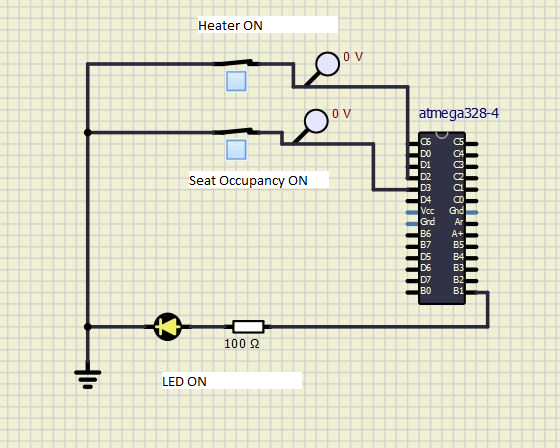

# Activity 1: Turning on an LED when both Driver's Seat is OCCUPIED and Heater is turned ON
## LED OFF 
### Case 1: Driver's seat is OCCUPIED, Heater is OFF

### Case 2: Driver's seat is UNOCCUPIED, Heater is ON

### Case 3: Driver's seat is UNOCCUPIED, Heater is OFF

## LED ON 
### Case 1: Driver's seat is OCCUPIED, Heater is ON

